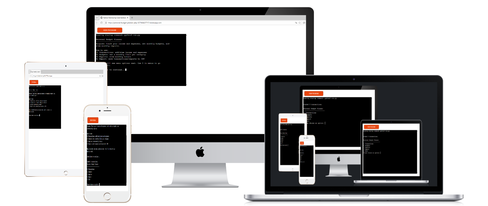
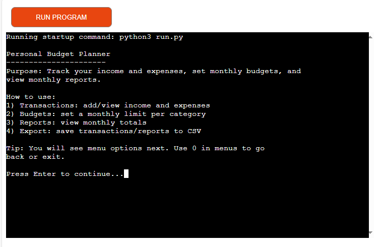
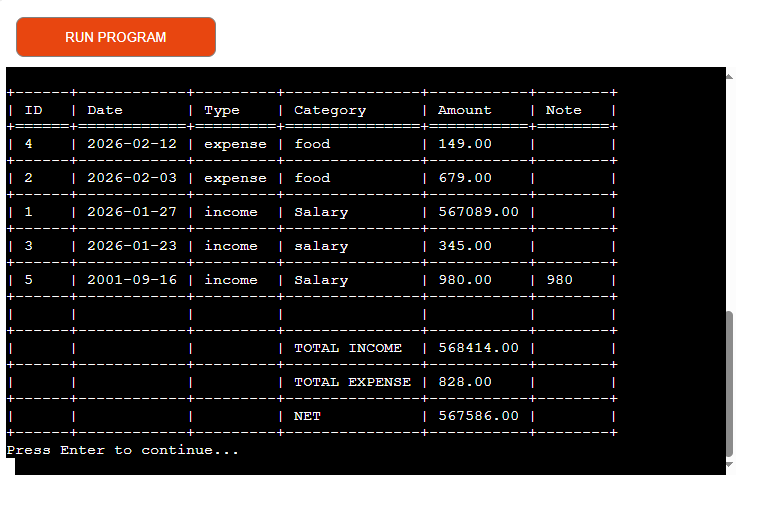
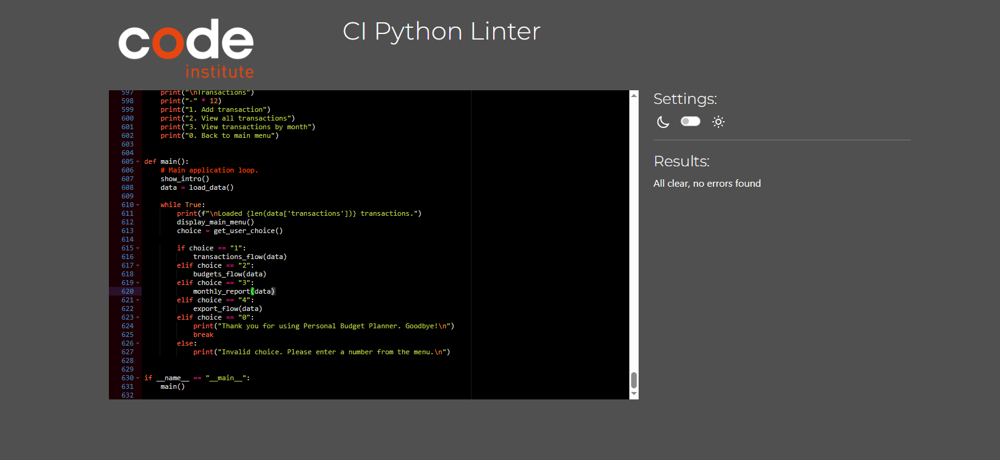

# Personal Budget Planner

## Project Overview

- Personal Budget Planner is a command-line Python application that helps users track income and expenses, set monthly budgets by category, view monthly financial reports, and export data to CSV files. The application is designed for users who want a simple, text-based tool to manage their personal finances without relying on spreadsheets or external services.

- The project is built using the Code Institute Python Essentials Template and is deployed to Heroku using a mock terminal interface.

- [Here is a link to my deployment](https://personal-budget-planner-pbp-3271b8a37717.herokuapp.com/)

## Target Audience

This application is intended for individuals who want a simple, text-based tool to track their personal finances. It is suitable for users who prefer a command-line interface and want to manage budgets without using spreadsheets or external financial applications.

## User Goals

- Record income and expense transactions

- View a list of all transactions

- See monthly summaries of income, expenses, and balance

- Set monthly budgets for spending categories

- Compare budgets against actual spending

- Export transactions and reports to CSV files

## Site Owner Goals

- Provide a clear, easy-to-use command-line interface

- Ensure all user input is validated to prevent errors

- Store data persistently between sessions

- Demonstrate clean, well-structured Python code

## Application Features

### Main Menu

The main menu allows the user to navigate between:

- Transactions

- Budgets

- Reports

- CSV Export

- Exit

The application runs in a loop until the user chooses to exit.

### Transactions

- Add a transaction with date, type (income/expense), category, amount, and optional note

- View all saved transactions

- Transactions are stored persistently in Google Sheets

### Monthly Reports

- Generate a monthly report by entering a month in YYYY-MM format

- Displays total income, total expenses, and balance for the selected month

### Budgets

- Set or update a monthly budget for a specific category

- View budget status for a selected month

- Shows spending, remaining budget, or overspend amount

### CSV Export

- Export all transactions to transactions.csv

- Export a monthly summary report to monthly_report_YYYY-MM.csv

## Data Model

- Google Sheets was used as the primary data storage solution for this project.

- Two worksheets are used:
  - `transactions`
  - `budgets`

- This approach allows data to persist between sessions while avoiding local file storage issues on Heroku.

### Transactions worksheet structure

| id | date | type | category | amount | note |
|----|------|------|----------|--------|------|

### Budgets worksheet structure

| month | category | limit |
|------|----------|-------|

- Data is loaded at application startup and written back to Google Sheets whenever a transaction or budget is added or updated.

## Program Flow

- The application starts in run.py

- Data is loaded from Google Sheets on application startup

- User input is handled through dedicated prompt functions

- Feature-specific logic is separated into reusable functions

- Data is written back to Google Sheets after changes

## Input Validation and Error Handling

- All numeric inputs are validated to ensure correct format and range

- Date and month inputs are validated to prevent invalid values

- Menus handle invalid selections gracefully without crashing

## Testing

### Manual testing

- Manual testing was carried out during development to ensure the application behaves as expected.

| Feature | Test Case | Expected Result | Outcome |
| ------- | --------- | ---------------- | ------- |
| Main Menu | Enter invalid input | Error message displayed | Pass |
| Add Transaction | Enter valid data | Transaction saved to Google Sheets | Pass |
| Add Transaction | Enter invalid amount | Prompt user again | Pass |
| View Transactions | No transactions exist | Message shown | Pass |
| Monthly Report | Valid month entered | Correct totals shown | Pass |
| Budgets | Set budget and compare | Remaining/overspent shown | Pass |
| Budgets | Update existing budget | Budget updated in Google Sheets | Pass |
| CSV Export | Export transactions | CSV file created | Pass |

### Code Validation

- The Python code was tested using the Code Institute PEP8 validator:
[pep8ci](https://pep8ci.herokuapp.com/)

- Minor formatting issues were identified, such as missing final newlines and inconsistent spacing.  
- These issues were corrected to ensure the code conforms to PEP8 standards.

## Bugs and Fixes

### Bug: Budget category saved as number instead of text

- **Issue**: When setting a budget, the category value was incorrectly saved as the numeric limit (e.g. `200` instead of `Food`).
- **Cause**: Variable misalignment when passing parameters to the budget update function.
- **Fix**: Refactored the `set_budget()` logic and introduced a dedicated `upsert_budget()` function to correctly separate category and limit handling.

### Bug: Duplicate budgets created for the same month and category

- **Issue**: Setting a budget for the same month and category created duplicate rows instead of updating the existing one.
- **Fix**: Implemented an upsert pattern that checks for an existing `(month, category)` pair before updating or appending.

### Bug: Tables not displaying correctly in terminal

- **Issue**: Transaction and budget data printed as plain text instead of formatted tables.
- **Fix**: Added the `tabulate` library and refactored output logic to display data in structured tables.

### Bug: Category matching failed due to inconsistent casing

- **Issue**: Budgets were not matched correctly due to case differences (e.g. `food` vs `Food`).
- **Fix**: Normalized category input using `.strip().lower()` for comparisons and `.title()` for display.

### Bug: Import errors during refactoring

- **Issue**: Application failed to start due to incorrect imports after refactoring storage logic.
- **Fix**: Consolidated Google Sheets logic into `storage_sheets.py` and updated imports consistently.

## Libraries and Technologies Used

### Python Standard Library

- [csv](https://docs.python.org/3/library/csv.html) 
    - Used to export transaction data and reports.

- [datetime](https://docs.python.org/3/library/datetime.html)
   -  Used to validate date input.

- [os](https://docs.python.org/3/library/os.html)
   -  Used for file and folder handling.

### External Libraries

This project is based on the Code Institute Python Essentials Template, which includes:
- [gspread](https://pypi.org/project/gspread/)
   - Used to connect to and interact with Google Sheets.

- [google-auth](https://pypi.org/project/google-auth/)
  - Used to connect to and interact with Google Sheets.

-  [tabulate](https://pypi.org/project/tabulate/)  
   - Used to display transactions, budgets, and reports in formatted tables within the terminal.

## Future Features

- User authentication to support multiple users
- Category-based charts and visual summaries
- Ability to edit or delete existing transactions
- Export budgets alongside transactions
- Support for different currencies

## Deployment

The project is deployed to Heroku using the Code Institute Python Essentials Template.

Deployment steps:

1. Create a new Heroku app

2. Set the buildpacks to Python and Node.js

3. Connect the Heroku app to the GitHub repository

4. Deploy the main branch

## Credits

- Code Institute Python Essentials Template

- Python documentation

- [Website Mockup Generator](https://websitemockupgenerator.com/)  
   - Used to create the project mockup image displayed in the documentation.

## Acknowledgements

This project was developed as Portfolio Project 3 for the Diploma in Full Stack Software Development at Code Institute.

---
